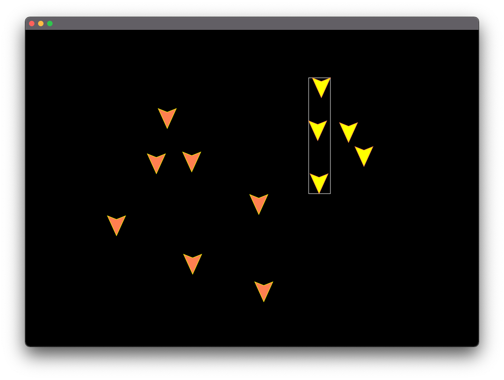

# Ship Application

A JavaFX application which lets users create, move, and select ships. Supports grouping operations and a built-in clipboard.

## Overview
* This repository contains all the code for the application which was built using Java with JavaFX framework.
* Implemented using Model-View-Controller architecture, Publish-Subscribe communication model and 2D Graphics.
* Selected ships or groups are drawn with a yellow fill.
* Selected group of ships show a bounding box around them.

## Supported Actions
1. Creation of ships by `Shift-Clicking`.
2. Selection of single ship by `Left-Clicking`.
3. Selection of multiple ships by `Control-Clicking`.
4. Selection of multiple ships by `Left-Clicking` on the background and dragging the mouse to do a rubber-band selection.
5. Rubber-band selection while holding the `Control` key deselects existing selected ships. 
6. `Control + C` copies the selected ships/groups.
7. `Control + X` cuts the selected ships/groups.
8. `Control + V` does a paste.
9. Move selected ships or groups by a `Left-Click` drag.
10. Group selected ships by pressing the `G` key.
11. Ungroup a selected group by pressing the `U` key.

## Instructions for Running the Application
1. Please download the full source code or clone this repository.
2. Open the folder as an existing project in your IDE of choice (I use IntelliJ).
3. Navigate to `/src/main/java/com/example/ships_application/`.
4. Open the main file which starts the application named `ShipApplication.java`.
5. Run the main method by clicking on the play button in the gutter.